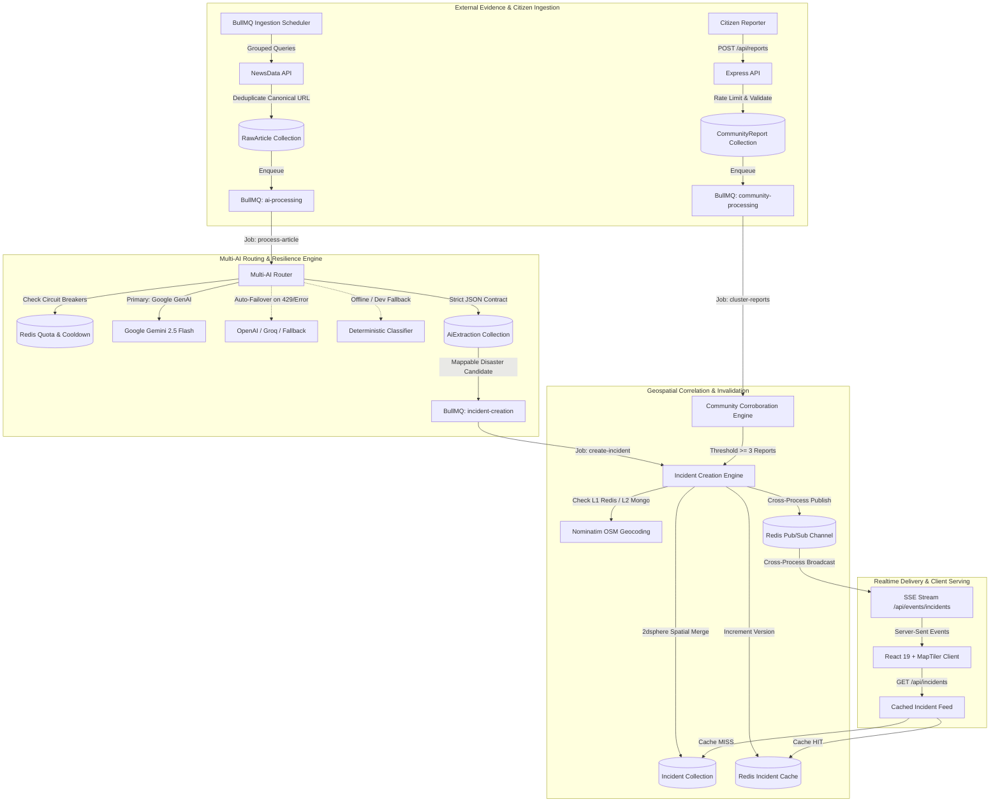

# Calamity Tracker — System Architecture & Design Specification

Calamity Tracker is an event-driven disaster intelligence platform designed to separate raw provider evidence, multi-AI natural language extraction, crowd-sourced community corroboration, geospatial clustering, and map-ready public incidents.

---

## 1. High-Level Architecture Topology



---

## 2. Core Architectural Principles

1. **Evidence Immutability**:
   `RawArticle` records retain the pristine provider payload. AI extraction output never mutates or overwrites raw evidence.
2. **Auditable Interpretations**:
   Every `AiExtraction` records the provider (`gemini`, `openai`, `mock`), model name, prompt version, execution latency, and any failover reasons.
3. **Candidate vs. Active Public Incidents**:
   Uncorroborated reports or initial AI extractions create `candidate` incidents. Only official verification or multi-citizen corroboration elevates status to `active`.
4. **Citizen Privacy Guarantees**:
   Exact GPS coordinates submitted by citizens are strictly utilized on the backend for spatial clustering (`$near`). Public map endpoints (`GET /api/reports`) automatically jitter/round coordinates (~1.1 km precision) and incident locations use cluster centroids.
5. **Cross-Process Scalability**:
   API and background workers are independent services. Real-time updates utilize Redis Pub/Sub (`calamity:realtime-events`) to fan out background worker events to all connected API Server-Sent Event (SSE) clients.

---

## 3. Multi-AI Routing & Resilience Engine

### 3.1 Routing Architecture

The AI layer decouples classification from any single vendor SDK:
- **`GeminiProvider`**: Primary provider utilizing `@google/genai` (`gemini-2.5-flash`).
- **`OpenAICompatibleProvider`**: Secondary / failover provider compatible with OpenAI (`gpt-4o-mini`), Groq (`llama-3.3-70b-versatile`), DeepSeek, OpenRouter, or local Ollama instances.
- **`MockProvider`**: Deterministic rule-based classifier providing zero-token offline execution for local development and CI testing.

### 3.2 Failure Modes & Circuit Breaking

```text
Incoming Article
       │
       ▼
Check Gemini Cooldown (Redis) ──[Cooldown Active]──► Try Next Provider (OpenAI)
       │
  [Available]
       │
Acquire Gemini Daily Quota ──[Quota Exhausted]──► Try Next Provider (OpenAI)
       │
  [Allowed]
       │
Call Gemini API ──[HTTP 429 / Quota Error]──► Set Redis Cooldown Key ──► Fallback to OpenAI
       │
   [Success]
       │
Validate Schema ──► Persist AiExtraction with routing metadata
```

- When a provider responds with HTTP `429` or `RESOURCE_EXHAUSTED`, `activateProviderCooldown` writes `ai:cooldown:<provider>` with a configurable TTL (default: 86,400s or provider `retry-after`).
- Subsequent requests bypass the failing provider instantly, preventing queue backlogs and pipeline stalls.

---

## 4. Community Corroboration & Geospatial Clustering

### 4.1 Corroboration Lifecycle

1. **Submission**:
   Citizen submits a report with client-generated idempotency key (`clientReportId`). The reporter identifier is hashed with SHA-256 (`reporterHash`).
2. **Proximity Search**:
   The engine searches for active/candidate incidents within `COMMUNITY_CLUSTER_RADIUS_METERS` (default: 5,000m) using MongoDB `2dsphere` indexes.
   - If an incident exists: the report attaches directly as corroborating evidence (`$addToSet: { evidenceReports }`), incrementing `communityReportCount`.
3. **Cluster Thresholding**:
   If no existing incident is found, nearby unattached reports within the cluster time window (default: 24h) are grouped by unique `reporterHash`.
   - When independent distinct reporters reach `COMMUNITY_CONFIRMATION_THRESHOLD` (default: 3), the cluster centroid is calculated:
     $$\bar{P} = \left( \frac{1}{N}\sum_{i=1}^N \text{lng}_i, \; \frac{1}{N}\sum_{i=1}^N \text{lat}_i \right)$$
   - A new `candidate` Incident is created at the centroid with highest observed severity.
4. **Peer Corroboration**:
   Citizens viewing active signals on the map can vouch with `POST /api/reports/:id/corroborate`. Re-corroboration by the same reporter is blocked by hash validation.

---

## 5. Caching & Persistence Hierarchy

| Layer | Technology | Key Pattern / Collection | TTL | Purpose |
| --- | --- | --- | --- | --- |
| **L1 Incident Cache** | Redis String | `incidents:v{version}:status={s}:limit={l}` | 60s | High-concurrency map feed serving |
| **L1 Geocode Cache** | Redis String | `geo:cache:{normalized_query}` | 7 Days | Sub-millisecond repeated location lookups |
| **L2 Geocode Cache** | MongoDB | `GeocodeCache` | Persistent | Persistent lookup storage across Redis flushes |
| **Evidence Store** | MongoDB | `RawArticle` | Persistent | Source payloads with unique canonical URL |
| **Extractions Store**| MongoDB | `AiExtraction` | Persistent | Auditable model outputs & confidence |
| **Incidents Store** | MongoDB | `Incident` | Persistent | GeoJSON `2dsphere` indexed map entities |
| **Citizen Signals** | MongoDB | `CommunityReport` | Persistent | Rate-limited citizen observations |

### Cache Invalidation

Cache invalidation is atomic and non-blocking:
When an incident is created or updated, `incidents:cache-version` in Redis is atomically incremented (`INCR`). All subsequent reads query the new cache key pattern, rendering previous cached versions obsolete without issuing expensive `KEYS` or `SCAN` deletions.

---

## 6. BullMQ Asynchronous Queues

| Queue Name | Concurrency | Retry Backoff | Responsibility |
| --- | --- | --- | --- |
| `news-ingestion` | 1 | Exponential (5s) | Periodic cron execution of provider queries and URL deduplication |
| `ai-processing` | 1 | Exponential (5s) | Bounded AI article classification with multi-provider routing |
| `incident-creation`| 1 | Exponential (5s) | Geocoding, spatial deduping, and incident creation/merging |
| `community-processing` | 2 | Exponential (5s) | Async clustering of community reports and centroid calculations |

---

## 7. Scaling & Production Strategy

1. **Stateless API Instances**:
   Express HTTP instances run behind an Nginx or ALB load balancer. Because real-time SSE fanout is backed by Redis Pub/Sub, clients can connect to any API replica and receive broadcasts uniformly.
2. **Dedicated Background Workers**:
   Workers operate in separate containers/processes (`npm run worker`), consuming BullMQ jobs from Redis. Upstream rate limits (Nominatim 1 req/sec, Gemini daily budget) are strictly controlled at the worker concurrency boundary.
3. **GeoJSON Indexes**:
   All geospatial queries use spherical geometry (`$geometry` and `2dsphere` indexes). Coordinates adhere strictly to GeoJSON `[longitude, latitude]` order.
